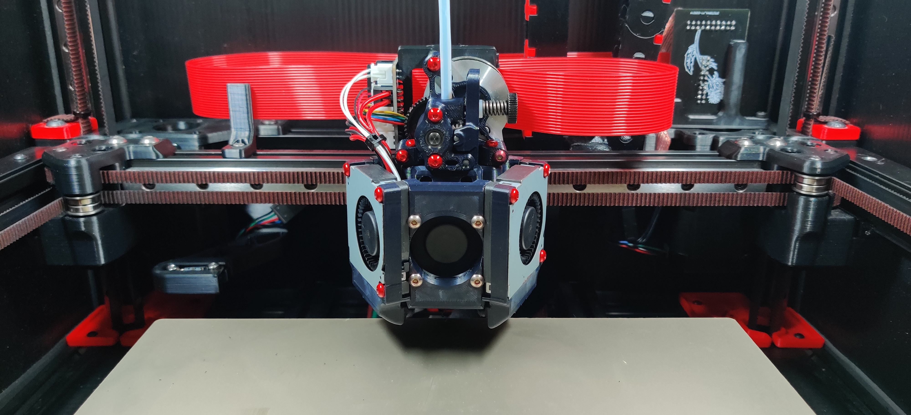

# The DirtyBird toolhead

Developed as the successor of the Frankensherpa toolhead.

Like its predecessor, DirtyBird is designed to:

- Be lightweight, allowing greater acceleration and potentially improved resonance
- Have excellent cooling performance, with dual blower fans to improve overhang performance with many materials (including PLA)
- Have fans that are mounted low on the toolhead (cf. Afterburner) to improve resonance
- Allow for easy maintenance of the extruder
- Use a simplified carriage with integrated magprobe support
- Remain compatible with stock Voron (and Ramalama) idlers
- Support Roadkill-based chainless toolhead boards

Currently, DirtyBird supports the following extruders:

| Extruder | Status |
| ------- | ------- |
| LGX mini | Full support |
| Sherpa mini | Full support |
| Sherpa micro | Full support |
| CNC Vz Hextrudort Low | Experimental (fits stock LGX plate) |
| Orbiter | Usermod |

And the following hotends:

| Hotend | Status |
| ------- | ------- |
| Dragon (SF/HF/UHF) | Full support |
| NF Crazy | Full support |
| Rapido HF | Full support |
| Rapido UHF | Not currently supported |
| Revo | Usermod |
| Bambu | Experimental |

### BOM

[See BOM](./docs//bill-of-materials.md)

### Build Instructions

[See Build Instructions](./docs/build.md)

### Planned features

- MGN9 support (currently, the carriage fits MGN12 rails only)
- Integrated LED lighting (using Neopixels, currently experimental)
- Rapido hotend support (currently experimental)
- TAP support (currently experimental)
- 9 mm belts (AKA Fatso, currently experimental)

### Known issues/to do list

- Potentially insufficient clearance between the Dragon core and the heater block of the Dragon hotend; as a result, the core may melt or otherwise cook, especially when using a silicone sock
  - Improvements have been made, but we are gathering feedback from real world usage.
  - Current data suggest this is no longer an issue, but please make a report if you see any heat-related damage to the core
- Rename files for version control/clarity (i.e. similar to Annex)
- Printed L/R marks for the fan ducts
