# DirtyBird Build Instructions

See [printed parts](./printed-parts.md) for a list of required 3d printed parts.

### Step 1: Preparing Parts

Remove any supports (e.g. the supports included in the pre-supported core variants)

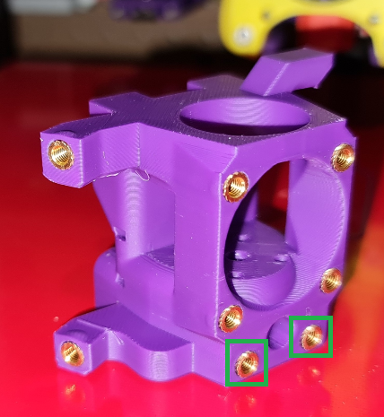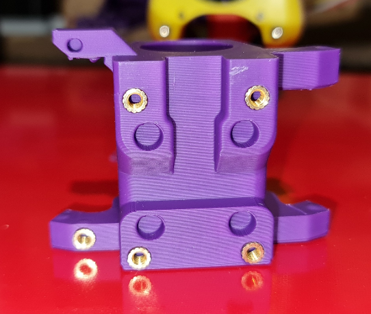

Core heatset inserts part 1; inserts shown in green squares are only required for toolheads using a mounting plate (i.e. do not install these if you are using a Sherpa micro)

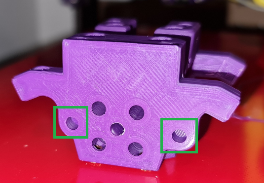

Core heatset inserts part 2; add inserts shown in the green squares if you are using a Sherpa micro

Note: for release v1 (or earlier versions), you may need to drill out the PTFE tube path with a 4 mm bit, otherwise it may be difficult to push the tube through.

Carriage heatset inserts (required for all extruders, the cable guide will attach to these)

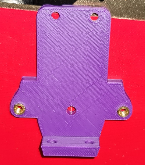

If you are using a mounting plate for the Sherpa mini\BMG extruder, add two heatset inserts as shown

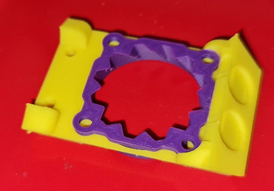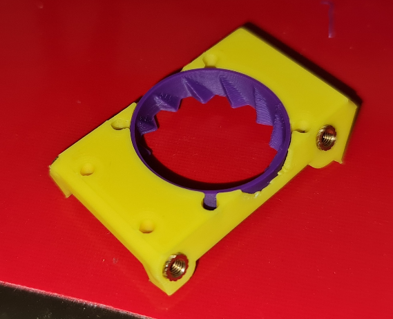

If you are using a two-piece fan brace, carefully combine the two pieces BEFORE proceeding to heatset insertion. The toothed (or blank) insert will impart much needed rigidity to the brace.

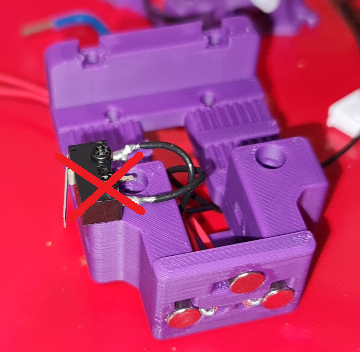

- Press three 6x3 magnets into the carriage. Refer to Klicky documentation regarding the polarity of these magnets.
- Pressing the magnets against a flat surface is recommended to keep the surface as flat as possible; this improves the reliability of the Klicky probe.
- The carriage may slightly crack during this process, use cyanoacrylate glue to make repairs and to secure the magnets.
- You may attach the X endstop to the carriage at this stage, or leave it off for easier assembly in a future step.

### Step 2: Core Assembly

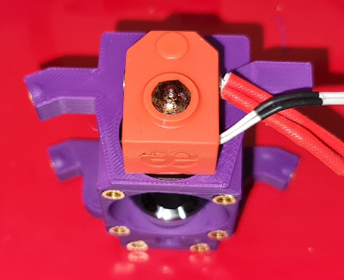

- Insert your hotend into the core. For Dragon hotends, take note of the nozzle/block orientation. The nozzle should be closer to the front (i.e closer to the 3010 cooling fan).
- Use the appropriate bolts to secure the hotend to the core (e.g. M2.5x10 SHCS for Dragon hotends)

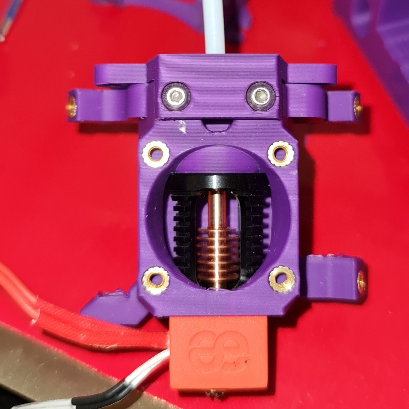

- Use two M3x6 BHCS to secure the mounting plate to the core (if you require a mounting plate). Do not overtorque!
- Push through a 4mm OD PTFE tube through the top until it contacts the hotend.
- The recommended tube length is ~30 mm for a Dragon hotend and Sherpa mini extruder; you may have to find the appropriate length for your chosen combination of hotend and extruder.

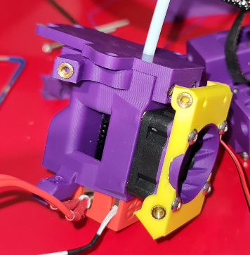

- Attach the 3010 hotend cooling fan and fan brace to the core using four M3x20 BHCS, as shown
- The fan should be drawing air towards the hotend (i.e. the sticker should not be visible from the front)

### Step 3: Fan Assembly

Slide the fan ducts over the 4510 blower fans. Then, secure the fan assemblies to the core and fan brace using 3 M3x12 BHCS per duct, as shown below.

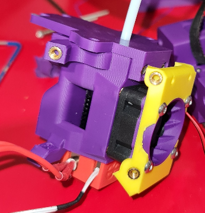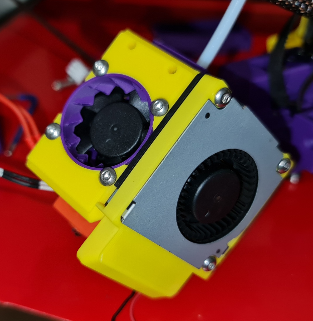

### Step 4: Mounting the extruder

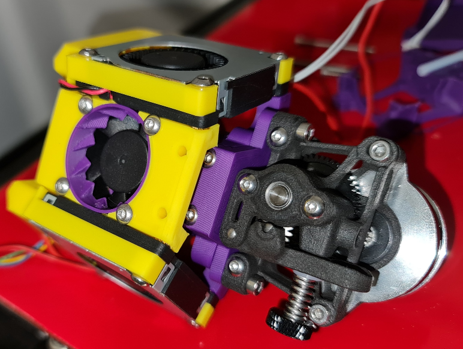

- Use two mounting bolts (e.g. M3x10 BHCS for the Sherpa mini extruder) to secure the extruder to the mounting plate.
- Do not forget to include a PTFE tube between the extruder and hotend!

### Step 5: Carriage Assembly

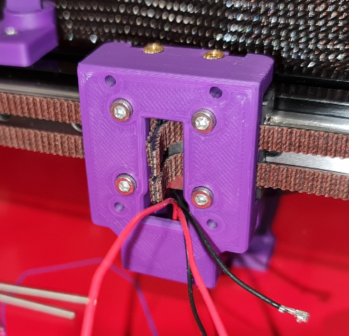

- As with the stock Voron carriage, the belts are secured between the carriage and the block. Thread the belts and Klicky-related wires (red wires in this diagram) through the hole, as shown.
- If you are using an X endstop microswitch, you can either attach the microswitch or keep it off for easier assembly. However, ensure that the wires are pushed through the cavity, as shown (black wires).
- Use four M3x8 SHCS to attach the carriage to the block. The heads will sit proud (sticking out), which will help with alignment during final assembly. The exact depth of these bolts isn’t essential, but ensure the carriage is secured tightly against the rail block to reduce unwanted play.

### Step 6: Final Assembly

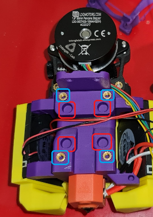

- Before proceeding, take note of the channel dedicated to wiring (black and red wires shown here).
- Also, the holes indicated by red boxes are to help with alignment (as indicated in the previous step).
- The heatset inserts within the blue boxes are used to attach the toolhead to the carriage.

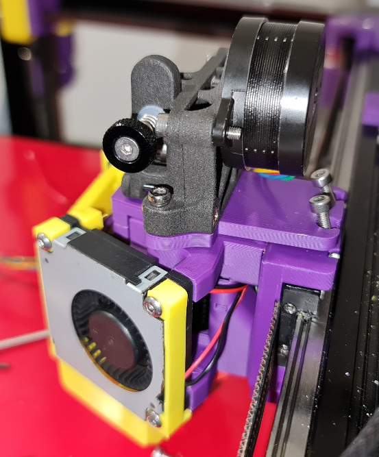

- Line up the toolhead and carriage and use four M3x20 SHCS to attach the toolhead.
- If you are using a mounting plate, use two M3x8 SHCS to secure it to the carriage.
- You may now attach the X endstop microswitch to the carriage (if not already installed).
- If the microswitch is already installed on the carriage, you will need to slide the carriage on from the side of the block, as the switch will prevent the carriage being applied ‘head on’

For wiring instructions, consult Roadkill longboi documentation.
