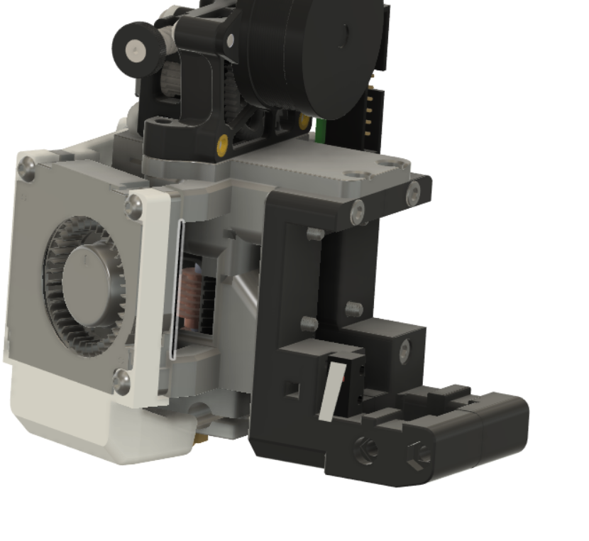

# Mod description

**DB carriage for Switchwire machines**

Replaces the carriage for Switchwire support (plus Euclid mounting); adds Euclid dock parts (including servo mounts)

# Status

To be confirmed

# Incompatibilities

To be confirmed; Euclid probe only (i.e. no Klicky/Tap support)

# Update notes

To be confirmed

# Instructions

**Print settings**

To be confirmed

**Additional hardware**

To be confirmed
