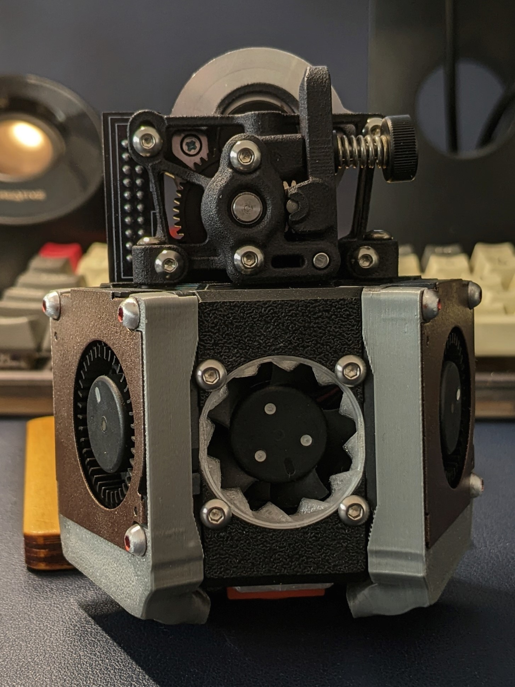

# Mod description

**DB Sushei variant**

Overhauls the DB with various changes to allow direct mounting of a Sherpa Mini to the core, and adds LED support. Please refer to the README docx file for a full list of changes.

# Status

Release (TBC)

# Incompatibilities

Please refer to the detailed readme for incompatible parts

# Update notes

TBC

# Instructions

**Print settings**

TBC

**Additional hardware**

TBC; 2x Neopixel LEDs
